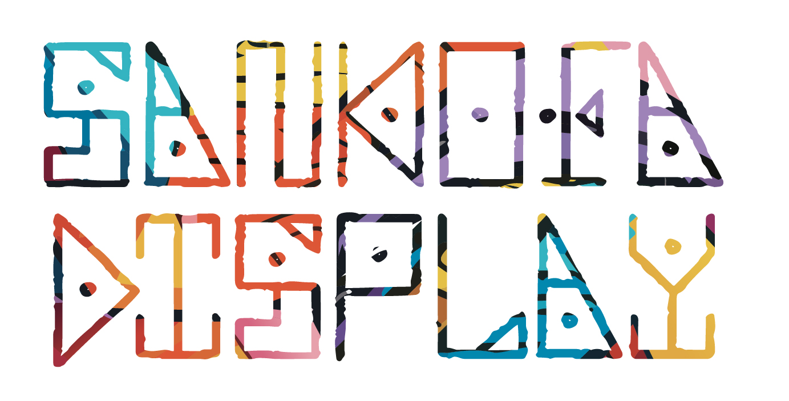
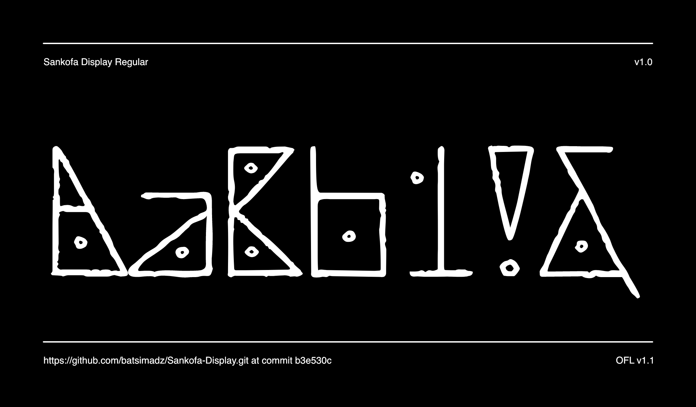

# Sankofa Display

Sankofa Display is a typeface that draws inspiration from African art styles, with a focus on straight-line geometric designs.

Website: https://www.sankofadisplay.com

## Inspiration

### Zimbabwean clay pot ### 

Rooted in African heritage, the typeface harmonizes straight lines with circles and dots, mirroring the intricate patterns seen in everyday items like the Zimbabwean clay pot. Growing up surrounded by these designs, I drew influence from their geometric precision.

### Zimbabwe bird ### 

This stone-carved bird is the national emblem of Zimbabwe, appearing on the national flag and coats of arms. The hungwe, Zimbabwean bird, contributes to the typeface with its intricate geometric motifs found at the base of the sculptures.

### Zulu bead work & art ### 

The vibrant Zulu traditional patterns add a colorful palette, creating a visually captivating and culturally resonant typeface that celebrates Africa’s geometric heritage in a concise and impactful manner.

## Thanks to
Thomas Phinney 
Nathan Willis 
Lisa Huang 
Dave Crossland

## About the author

Batsi is a design leader and speaker who advocates for cultural authenticity and inclusion in design. As a passionate designer, he celebrates diversity, challenges stereotypes, and empowers communities through his work. He represents African design on a global scale, showcasing its richness, creativity, and innovation. He also shares his insights and experiences on how to design with respect, empathy, and collaboration at various events and conferences.

## Changelog

When you update your font (new version or new release), please report all notable changes here, with a date.
[Font Versioning](https://github.com/googlefonts/gf-docs/tree/main/Spec#font-versioning) is based on semver. 
Changelog example:

**15 December 2023. Version 1.0**
- Font published

## License

This Font Software is licensed under the SIL Open Font License, Version 1.1.
This license is available with a FAQ at
https://scripts.sil.org/OFL

## Repository Layout

This font repository structure is inspired by [Unified Font Repository v0.3](https://github.com/unified-font-repository/Unified-Font-Repository), modified for the Google Fonts workflow.

---

[![][Fontbakery]](https://batsimadz.github.io/Sankofa-Display/fontbakery/fontbakery-report.html)
[![][Universal]](https://batsimadz.github.io/Sankofa-Display/fontbakery/fontbakery-report.html)
[![][GF Profile]](https://batsimadz.github.io/Sankofa-Display/fontbakery/fontbakery-report.html)
[![][Outline Correctness]](https://batsimadz.github.io/Sankofa-Display/fontbakery/fontbakery-report.html)
[![][Shaping]](https://batsimadz.github.io/Sankofa-Display/fontbakery/fontbakery-report.html)

[Fontbakery]: https://img.shields.io/endpoint?url=https%3A%2F%2Fraw.githubusercontent.com%2Fbatsimadz%2FSankofa-Display%2Fgh-pages%2Fbadges%2Foverall.json
[GF Profile]: https://img.shields.io/endpoint?url=https%3A%2F%2Fraw.githubusercontent.com%2Fbatsimadz%2FSankofa-Display%2Fgh-pages%2Fbadges%2FGoogleFonts.json
[Outline Correctness]: https://img.shields.io/endpoint?url=https%3A%2F%2Fraw.githubusercontent.com%2Fbatsimadz%2FSankofa-Display%2Fgh-pages%2Fbadges%2FOutlineCorrectnessChecks.json
[Shaping]: https://img.shields.io/endpoint?url=https%3A%2F%2Fraw.githubusercontent.com%2Fbatsimadz%2FSankofa-Display%2Fgh-pages%2Fbadges%2FShapingChecks.json
[Universal]: https://img.shields.io/endpoint?url=https%3A%2F%2Fraw.githubusercontent.com%2Fbatsimadz%2FSankofa-Display%2Fgh-pages%2Fbadges%2FUniversal.json
