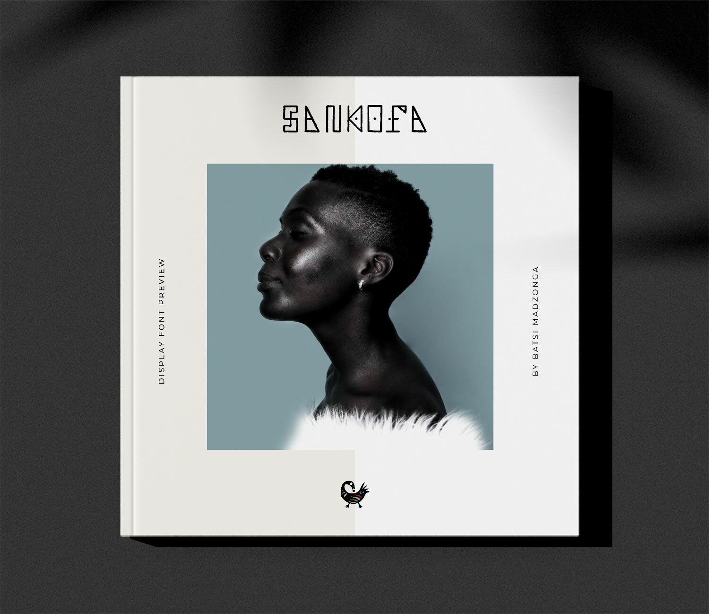

# Sankofa

[![][Fontbakery]](https://batsimadz.github.io/test/fontbakery/fontbakery-report.html)
[![][Universal]](https://batsimadz.github.io/test/fontbakery/fontbakery-report.html)
[![][GF Profile]](https://batsimadz.github.io/test/fontbakery/fontbakery-report.html)
[![][Outline Correctness]](https://batsimadz.github.io/test/fontbakery/fontbakery-report.html)
[![][Shaping]](https://batsimadz.github.io/test/fontbakery/fontbakery-report.html)

[Fontbakery]: https://img.shields.io/endpoint?url=https%3A%2F%2Fraw.githubusercontent.com%2Fbatsimadz%2Ftest%2Fgh-pages%2Fbadges%2Foverall.json
[GF Profile]: https://img.shields.io/endpoint?url=https%3A%2F%2Fraw.githubusercontent.com%2Fbatsimadz%2Ftest%2Fgh-pages%2Fbadges%2FGoogleFonts.json
[Outline Correctness]: https://img.shields.io/endpoint?url=https%3A%2F%2Fraw.githubusercontent.com%2Fbatsimadz%2Ftest%2Fgh-pages%2Fbadges%2FOutlineCorrectnessChecks.json
[Shaping]: https://img.shields.io/endpoint?url=https%3A%2F%2Fraw.githubusercontent.com%2Fbatsimadz%2Ftest%2Fgh-pages%2Fbadges%2FShapingChecks.json
[Universal]: https://img.shields.io/endpoint?url=https%3A%2F%2Fraw.githubusercontent.com%2Fbatsimadz%2Ftest%2Fgh-pages%2Fbadges%2FUniversal.json

Sankofa Display is a captivating African typeface that draws inspiration from a rich tapestry of African art styles, with a particular focus on straight-line geometric designs. This typeface embodies the essence of Africa's diverse cultural heritage, blending elements from various artistic traditions.

## About

After graduating from the University of Cape Town with a BSc in Computer Science, Batsi took his enthusiasm for digital platforms and entrepreneurship to start his own design agency. This period was instrumental in enhancing his skills set ranging from creative campaign ideation, software/website development, product design, and business development. 
 
His success then led him to roles within Africa and the Middle East where he now heads the design department at Abu Dhabi Islamic Bank in the capacity of Assistant Vice President, Head of Design & Experience.

His recent book available on Amazon, Devign Intervention is a collection of actionable tips on how he went from a graphic designer to Head of Design by the age of 35! It’s an easy read that allows you to not only level up your craft but add value to your company in new and tangible ways.

Links:
Website: https://www.madzonga.com
Book: https://www.amazon.com/dp/B0C91DKWK6
LinkedIn: https://www.linkedin.com/in/batsi

## Building

Fonts are built automatically by GitHub Actions - take a look in the "Actions" tab for the latest build.

If you want to build fonts manually on your own computer:

* `make build` will produce font files.
* `make test` will run [FontBakery](https://github.com/googlefonts/fontbakery)'s quality assurance tests.
* `make proof` will generate HTML proof files.

The proof files and QA tests are also available automatically via GitHub Actions - look at https://batsimadz.github.io/test.

## Changelog

When you update your font (new version or new release), please report all notable changes here, with a date.
[Font Versioning](https://github.com/googlefonts/gf-docs/tree/main/Spec#font-versioning) is based on semver. 
Changelog example:

**15 December 2023. Version 1.0**
- Font published

## License

This Font Software is licensed under the SIL Open Font License, Version 1.1.
This license is available with a FAQ at
https://scripts.sil.org/OFL

## Repository Layout

This font repository structure is inspired by [Unified Font Repository v0.3](https://github.com/unified-font-repository/Unified-Font-Repository), modified for the Google Fonts workflow.
